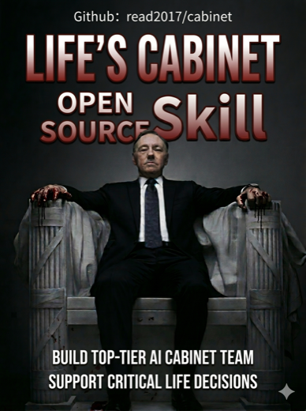

# Life Cabinet

> [中文](./README.md)

<p align="center">
  
</p>

> Upgrade major life decisions from "one AI suggestion" into an AI board meeting with probing questions, visible disagreement, red-team review, and durable reports.

`life-cabinet` is an agent skill for Codex, Claude Code, Gemini CLI, Cursor, and other mainstream agent tools that support skills, rules, or context extensions. It does not simply ask an AI to role-play several advisors. Instead, it turns a consultation into a disciplined decision process: define the decision first, freeze the current context, ask selected cabinet members to write independent memos, then synthesize the result through red-team review, cross-examination, and a final secretary-general judgment.

It is designed for decisions where a single quick answer is not enough:

- Career choices: job changes, career pivots, promotion, resignation, personal branding.
- Business judgment: startups, side projects, business models, partnerships, content monetization.
- Major life decisions: relocation, long-term planning, family responsibilities, lifestyle tradeoffs.
- Risk review: contracts, cash flow, investment exposure, execution resistance, plan blind spots.
- Periodic review: monthly, quarterly, or annual life board reviews.

## Features

- **Clarify before advising**: Major decisions must start with a decision-definition interview. If context is missing, the agent asks the questions that could change the conclusion.
- **Frozen decision context**: Before the meeting starts, the agent records known facts, core assumptions, unknowns, options, and decision thresholds.
- **Member memos, not role-play**: Key cabinet members write independent reports based on the same context, including reasoning chains, risks, counterfactuals, thresholds, and 30-day actions.
- **Red team and cross-examination**: High-risk decisions require a red-team reviewer and cross-examination to expose weak assumptions.
- **Complete report package by default**: Both Mode 1 and Mode 2 generate an HTML report, meeting notes, an analysis brief, and a member-report directory.
- **Real multi-agent mode when available**: The default mode works in one agent context. If your agent supports Subagents, you can request real delegated member analysis.
- **Long-term user profile**: Optional profile support helps the cabinet remember stable context while separating user-stated facts from AI inferences.
- **Clear professional boundaries**: Legal, medical, tax, investment, and mental-health topics are handled as risk identification and consultation preparation, not professional advice.

## What You Get

A full life-cabinet consultation usually produces:

- A chat summary with the decision, key risks, and next actions.
- An HTML report that can be opened in a browser, printed, or exported to PDF.
- Multiple member reports from relevant roles such as life strategy, career or business strategy, finance and risk, legal risk, gentle coach, and red team.
- Meeting notes preserving first-round positions, disagreements, cross-examination, and red-team challenges.
- A secretary-general analysis brief that turns member disagreement into actionable judgment, conditions, and recalculation triggers.

## Execution Modes

`life-cabinet` supports two execution modes:

| Mode | Best for | Description |
| --- | --- | --- |
| Mode 1: Deep Meeting Mode | Default mode for most agent tools | The current agent acts as the cabinet secretary-general and completes the interview, context freeze, member memos, red-team review, cross-examination, and final synthesis in one context. |
| Mode 2: Real Subagent Mode | Agents that support Subagents, multi-agent delegation, or task delegation | The secretary-general delegates key cabinet roles to Subagents for independent analysis, then synthesizes disagreements, runs follow-up questioning, and generates the final report. |

If your agent supports Subagents, explicitly request Mode 2:

```text
Use $life-cabinet in Mode 2: Real Subagent Mode to analyze this important decision.
```

If the current environment does not support Subagents, the skill will explain the limitation and fall back to Mode 1. For major decisions, both modes generate an HTML report and the full report package by default.

## Installation

Install from GitHub with the `skills` CLI:

```bash
npx skills add read2017/cabinet
```

After installation, restart or refresh your agent tool, then trigger the skill with `$life-cabinet`.

You can also manually copy the `life-cabinet/` directory into the target agent's skills, rules, or context-extension directory. The skill entrypoint is `SKILL.md`; UI metadata lives in `agents/openai.yaml`.

## Quick Start

```text
Use $life-cabinet to convene my Life Cabinet and analyze this decision:

Should I leave my big-tech job to build my own AI education product?

Context:
- I have 12 months of living expenses saved.
- I already have some paying users, but revenue is unstable.
- I worry about missing the window, but I also worry about cash flow.

Use a major decision meeting and include red-team review.
```

If the background is insufficient, life-cabinet will first run a decision-definition interview instead of producing a polished but weakly grounded answer.

For a lighter issue:

```text
Use $life-cabinet for a quick cabinet meeting:

I keep procrastinating on personal-brand content. Help me identify the bottleneck and give me 3 actions for this week.
```

HTML reports are generated by default:

```text
Use $life-cabinet to analyze this major decision.

Topic:
Should I accept my friend's partnership offer?

Context:
[Add facts, resources, constraints, deadline, and concerns.]
```

## Meeting Formats

| Format | Best for |
| --- | --- |
| Quick cabinet meeting | Everyday questions, short-term planning, low-risk choices, action bottlenecks |
| Major decision meeting | Resignation, startup, relocation, partnership, contract, major spending |
| Red-team review | Existing plans, business ideas, resumes, content strategies, negotiation plans |
| Quarterly life board review | Monthly, quarterly, or annual reviews and next-stage planning |
| One-page decision memo | Concise, shareable, archivable decision summaries |
| HTML report | Browser-readable, printable, or file-based deep analysis |

## Cabinet Members

Standing members include:

- Cabinet Secretary-General: hosts the meeting, defines the problem, synthesizes disagreement, and turns discussion into action.
- Life Strategy Advisor: evaluates long-term direction, value priorities, and identity costs.
- Business Strategy Advisor: analyzes business models, positioning, growth, and resource allocation.
- Career Advisor: evaluates opportunity cost, career capital, and compounding skill value.
- Finance and Risk Advisor: identifies cash-flow risk, downside risk, and safety-buffer issues.
- Legal Risk Advisor: identifies contract, compliance, liability, and evidence risks.
- Gentle Coach: handles anxiety, procrastination, execution resistance, and action design.
- Red-Team Reviewer: challenges assumptions, failure paths, and blind spots.
- Historical Perspective Seat: adds heuristic perspectives inspired by historical figures or public thinkers.

You can also create ad hoc expert seats, such as product advisor, technical strategy advisor, negotiation advisor, relationship communication advisor, or health-habit advisor.

## User Profile

For long-term use, you can create a user profile so the cabinet gradually understands your career assets, risk appetite, family responsibilities, execution patterns, and sensitive boundaries. The default location is:

```text
outputs/life-cabinet/user-profile.md
```

Profile rules:

- You can skip any question.
- Each entry should include source, date, confidence, and whether it may expire.
- User-stated facts must be separated from AI inferences.
- After each meeting, the skill only suggests profile updates and waits for your confirmation.
- In Mode 2, Subagents receive only role-relevant profile excerpts, not the full profile.

Template: [`life-cabinet/assets/user-profile-template.md`](./life-cabinet/assets/user-profile-template.md).

## HTML Reports

The latest life-cabinet version creates a separate report directory for each consultation instead of only returning a chat response. The HTML report uses:

```text
assets/report-template.html
```

Default output root:

```text
outputs/life-cabinet/
```

Each consultation creates its own directory, for example:

```text
outputs/life-cabinet/2026-06-19-1430-career-change/
```

A major decision report usually contains:

- `report.html`: final HTML report.
- `meeting-notes.md`: intermediate meeting notes.
- `analysis-brief.md`: secretary-general analysis brief.
- `members/`: independent member reports.

## Project Structure

```text
.
├── README.md
├── README.en.md
├── LICENSE
└── life-cabinet/
    ├── SKILL.md
    ├── agents/
    │   └── openai.yaml
    ├── assets/
    │   ├── 人生内阁封面.png
    │   ├── 人生内阁封面en.png
    │   ├── report-template.html
    │   └── user-profile-template.md
    └── references/
        ├── meeting-formats.md
        ├── members.md
        ├── prompt-templates.md
        ├── report-output.md
        └── user-profile.md
```

## Customization

- Edit member definitions: [`life-cabinet/references/members.md`](./life-cabinet/references/members.md).
- Edit meeting workflows: [`life-cabinet/references/meeting-formats.md`](./life-cabinet/references/meeting-formats.md).
- Edit reusable prompts: [`life-cabinet/references/prompt-templates.md`](./life-cabinet/references/prompt-templates.md).
- Edit profile rules: [`life-cabinet/references/user-profile.md`](./life-cabinet/references/user-profile.md).
- Edit HTML output rules: [`life-cabinet/references/report-output.md`](./life-cabinet/references/report-output.md) and [`life-cabinet/assets/report-template.html`](./life-cabinet/assets/report-template.html).

## Safety Boundaries

`life-cabinet` is for structured thinking and decision preparation. It does not replace qualified professionals.

- It does not provide legal opinions, medical diagnoses, tax advice, investment advice, or psychotherapy.
- It can help identify risks, prepare question lists, and organize consultation materials.
- If current law, market data, policy, tax rules, or recent facts affect the decision, those sources should be verified.
- Red-team review criticizes plans, assumptions, evidence, and incentive structures, not personal identity or worth.

## Contributing

Useful contribution areas:

- Add new ad hoc expert seats.
- Improve major decision and red-team review templates.
- Improve HTML report readability, printing, and archiving.
- Add reusable prompts.
- Strengthen profile privacy, versioning, and deletion workflows.

Keep `SKILL.md` concise. Put longer workflows, templates, and reference material in `references/` or `assets/`.

## License

MIT License. See [`LICENSE`](./LICENSE).
